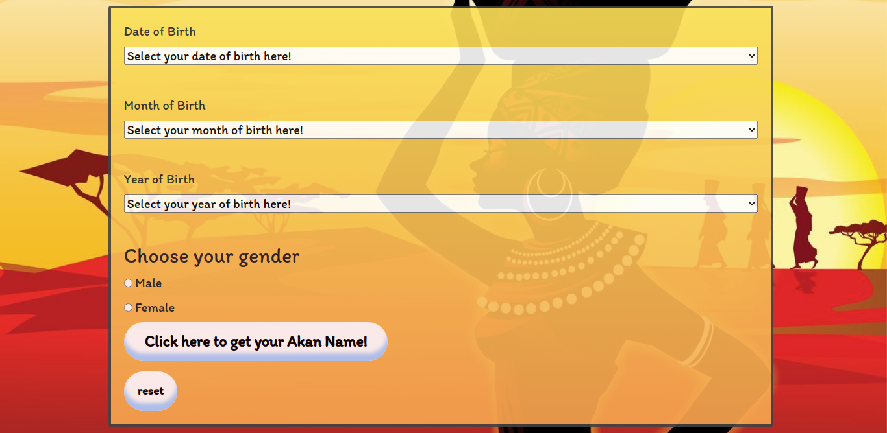

# Akan Name Generator
#### Brief description
This a web application which evaluates the day the user was born and returns an Akan name
based on the results. Date of current version: 13-12-2021
#### By **Soila Pertet**
## Screenshot

## Live demo
https://soilapertet.github.io/akan-names-project/
## Description
This is a web application which allows the user to enter their birthday through a form and, using the 
new Date() and getDay() methods, calculates the day of the week on which they were born. 
Consequently, the Akan name which corresponds with the evaluated day and gender of the user is then generated
and displayed in the form.
## Setup/Installation Requirements
* On the main page of the git repository,navigate to the button that says "Code" and copy the URL by clicking on the 
  clipboard button next to the URL.
* Open the terminal by clicking Ctrl+Alt+T
* Use the git clone command; git clone +URL+(in this case 'git clone https://github.com/soilapertet/akan-names-project.git'
* Open the folder using either VS Code or Atom; code . or atom .
* Open the live server to access the web applcaition. This is based on the assumption that you've installed 
  the 'Live-Server'(for VS code) or 'atom-live-serve'(for Atom). Here are some useful websites to get you started:
  <a href="https://stackoverflow.com/questions/50210151/how-to-launch-atom-live-server-step-by-step">How to launch Live Server on Atom</a> or
  <a href="https://www.freecodecamp.org/news/vscode-live-server-auto-refresh-browser/">How to launch Live Server on VS Code</a>
## BDD
User fills in the form entries
* Select the date of birth
* Select the month of birth
* Select the year of birth
* Select the gender
Results are submitted.
If field(s) is/are missing, an alert message is displayed.
If field(s) meet all the conditions, the program successfully evaluates the input data and outputs a result.
### Sample example:
Input
* date: 03
* month: 04
* year: 1940
* gender: Male

Output:Congratulations! You were born on a Wednesday and your Akan name is Kwaku!
## Known Bugs
There are currently no known bugs, but if you come across any, feel free to reach out to me through the provided email-address(es)
## Technologies Used
* HTML
* CSS
* Javascript
* Markdown
## Contact information
If you run into any issues or have any concerns, don't hesitate to contact me at:
<em>soila.pertet@student.moringaschool.com</em> or <em>nicolepertet@gmail.com</em>
### License
*MIT License*
Copyright (c) 2021 **Soila Pertet**
